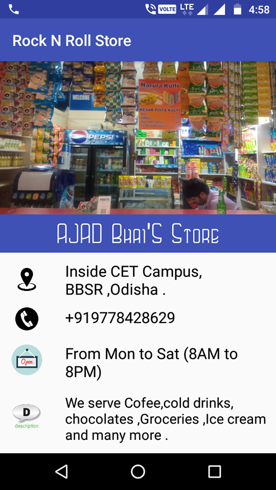
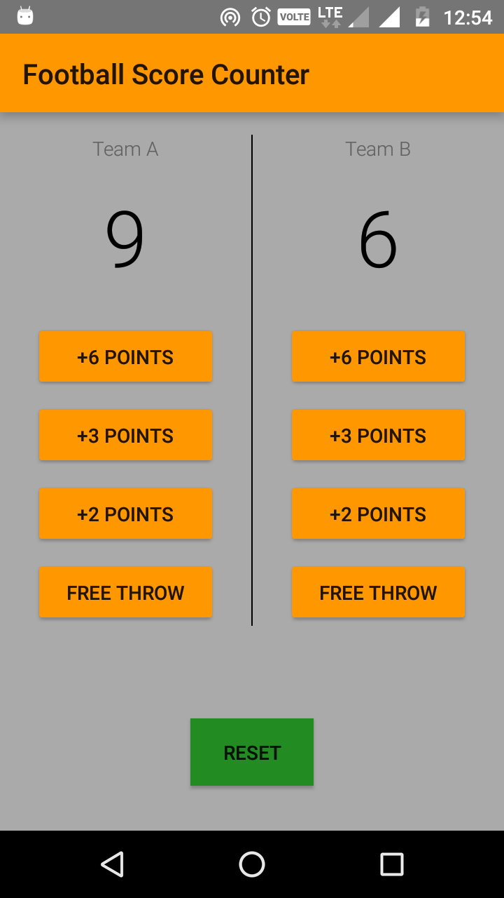

# Android Basics Nanodegree by Udacity
Android Basics courses on Udacity

## Project 1: [Build a Single Screen App](https://github.com/chinmaydas96/Android/tree/master/RockNRoll)
### Design and implement a simple app that displays information about a small business.
The app displays information about my favorite college shop. 

## Project 2: [Build Score Keeper App](https://github.com/chinmaydas96/Android/tree/master/CourtCounter)
### Design and implement a app that displays scores of Football game.
The goal is to create an Score Keeper app which gives a user the ability to keep track of the score of two different teams playing Football.

